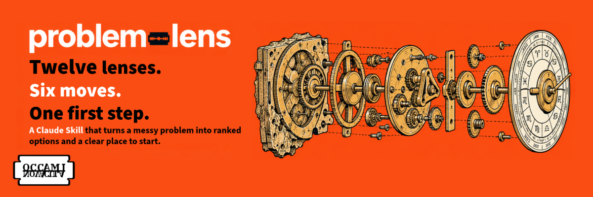

# problem-lens




A Claude Skill that tells you what to do first about a problem, backed by five diverse solutions and an Occam's Razor anchor, each from a lens chosen to fit the problem.

## Why

Most problem-solving prompts give you one angle. This one picks the best-fitting lens from each of five families and leads with a recommendation, so you can act right away. Each row says in one sentence why its lens fits, so you learn the judgment, not just the names. Ask for more and you get a fuller explanation and a source link.

## What It Does

- Answers right away, stating its assumptions instead of asking first.
- Names two or three likely explanations and the check that tells them apart.
- Recommends what to do first, and what would change that pick.
- Returns six moves in the order to act: five solutions from five lens families plus an Occam's Razor anchor.
- Ends with a prompt to expand a solution, add more, re-rank, or learn more about a lens.

## Sample Output

See [`problem-lens/examples/onboarding-drop-off.md`](problem-lens/examples/onboarding-drop-off.md) for a full run on the "Try First" problem below.

## Install

The Skill lives in the `problem-lens/` folder of this repo. Install that folder, not the whole repo.

### claude.ai and the Claude desktop app

1. Clone this repo.
2. From the repo root, zip the Skill folder: `zip -r problem-lens.zip problem-lens`
3. Turn on code execution in Settings.
4. Go to **Customize > Skills**, click **+**, choose **Create skill**, then **Upload a skill**. Upload `problem-lens.zip`.
5. Ask: "Analyze this problem: ..."

The steps are the same on the web and in the desktop app. Uploaded Skills apply to your account, not to a single Project.

Skills are built into Claude. You don't need to paste `SKILL.md` into a Project or into custom instructions. problem-lens is not an MCP server, so there is no `claude_desktop_config.json` to edit.

### Claude Code (personal)

1. Clone this repo.
2. Copy the `problem-lens/` folder into `~/.claude/skills/`.
3. Restart Claude Code.
4. Ask: "Analyze this problem: ..."

If you already uploaded the Skill in claude.ai, it also loads in Claude Code when you sign in with the same Claude account.

### Claude Code (project)

1. Clone this repo.
2. Copy the `problem-lens/` folder into `.claude/skills/` in your project repo.
3. Restart Claude Code.
4. Ask: "Analyze this problem: ..."

## Requirements

- **Claude access** with Skills support:
  - claude.ai or the Claude desktop app, with code execution on
  - Claude Code (CLI)
- **A problem to analyze.** The Skill needs a problem statement and background context.
- **No dependencies.** The Skill in `problem-lens/` is Markdown-only. No scripts, no packages, no API keys. The `evals/` folder holds a maintainer-only checker script that is not part of the install.

### Supported Platforms

| Platform | How to install |
|---|---|
| claude.ai | Upload `problem-lens.zip` in **Customize > Skills** |
| Claude desktop app | Same as claude.ai: **Customize > Skills** |
| Claude Code (personal) | `~/.claude/skills/problem-lens/` |
| Claude Code (project) | `.claude/skills/problem-lens/` |

The decision prompt uses `AskUserQuestion` when it is available. Otherwise the Skill shows a numbered list.

## Repo Layout

Only the `problem-lens/` folder is the Skill. Everything else supports development and testing.

```
problem-lens/                 repo root
├── problem-lens/             the Skill (install this folder)
│   ├── SKILL.md              instructions Claude follows
│   ├── references/           lenses, ranking frameworks, bias guards, output format, Learn more links
│   └── examples/             three recorded, unedited runs
├── evals/                    test rounds against plain Claude, plus the rule checker
├── assets/                   banner and social preview
├── .github/                  issue templates, PR template, CI checks
├── CHANGELOG.md
├── CODE_OF_CONDUCT.md
├── CONTRIBUTING.md
├── SECURITY.md
├── index.md                  GitHub Pages landing page
└── LICENSE
```

## Try First

Copy this prompt:

```
Analyze this problem: our onboarding drop-off is 60% at step 3.

Background: B2B SaaS, 200 signups per week, no user interviews yet.
```

## Lenses

| Family | Lenses |
|---|---|
| Generation | CPS, Divergent Thinking, Solution Space Exploration, TRIZ / TIPS |
| Diagnosis | Root Cause Analysis |
| Perspective | Cynefin, Six Thinking Hats |
| Fundamentals | First Principles, Occam's Razor (anchor only) |
| Process | Design Thinking, PDCA, OODA |

## Ranking Frameworks

Coverage (default), Impact vs. Effort, Confidence vs. Reversibility, ICE, RICE, Eisenhower, Regret Minimization, Optionality, Cost of Delay.

**How Coverage works:** it picks one solution from each of the five lens families, merges any that work the same way, and adds the anchor. Then it puts all six in the order to act: cheap checks that separate the likely explanations come first, then the moves with the most effect on the root problem. Ties go to the cheaper, more reversible move. Re-ranking with another framework changes the order and the recommendation.

## Output

1. Summary, three sentences or fewer, with stated assumptions
2. What's Likely Going On: two or three explanations, each with a check
3. Recommendation: "Do this first" and "Switch to … if"
4. Six-row table in the order to act, with a one-sentence `Why This Lens` on every row
5. Ranking line
6. Up to three questions whose answers would change the pick
7. Decision prompt: Expand, Add more, Re-rank, Learn more

**Learn more** gives a one-line explanation of each lens or framework, why it fit, and a link from a curated list in `problem-lens/references/learn-more.md`. The Skill never writes links from memory.

## Examples

See [`problem-lens/examples/`](problem-lens/examples/) for three recorded, unedited runs: onboarding drop-off, flat revenue, and a career decision.

## How It Was Tested

Each version is tested against plain Claude with no Skill, on the same problems, scored by blind judges. All runs, scores, and caveats are in [`evals/`](evals/).

| Version | Problems | Skill vs. plain Claude (wins–ties–losses) | Paired gap (out of 35) |
|---|---|---|---|
| 1.0.0 | 3 | 0–0–3 | −6.0 |
| Draft (round 2) | 11 | 0–2–9 | −2.5 |
| 1.1.0 | 11 | 5–2–4 | +0.1 |

1.1.0 leads on honesty, actionability, and option diversity. It trails on using the details you give it and on reading time. Future releases will explore fixes for these, and every round will be logged in `evals/`.

## When Not To Use

- You want a single answer, not options.
- The problem is trivial.
- You need code, not analysis.
- The decision is already made.

## The Family

problem-lens is one of two Skills from OCKHAM:

| Skill | Question | Shape |
|---|---|---|
| problem-lens | What should I do? | Twelve lenses, six ranked moves, one first step |
| [reasoning-lens](https://github.com/davehallmon/reasoning-lens) | How should I think about this? | Seven philosophers' methods, one idea, the disagreements |

Use reasoning-lens when you want to stress-test how you are thinking about an idea before you pick a move.

## Security and Privacy

The Skill is Markdown only. It makes no network calls, stores nothing, and sends nothing to the maintainer. Like any prompt, it cannot guarantee that Claude ignores instructions hidden in text you paste. See [`SECURITY.md`](SECURITY.md) for how it handles input and how to report a problem.

## Contributing

See [`CONTRIBUTING.md`](CONTRIBUTING.md). To report a problem or suggest an addition, use an issue template:

- [Bug report](https://github.com/davehallmon/problem-lens/issues/new?template=bug_report.md)
- [New lens request](https://github.com/davehallmon/problem-lens/issues/new?template=lens_request.md)
- [New ranking framework request](https://github.com/davehallmon/problem-lens/issues/new?template=framework_request.md)

## License

MIT. See `LICENSE`.
